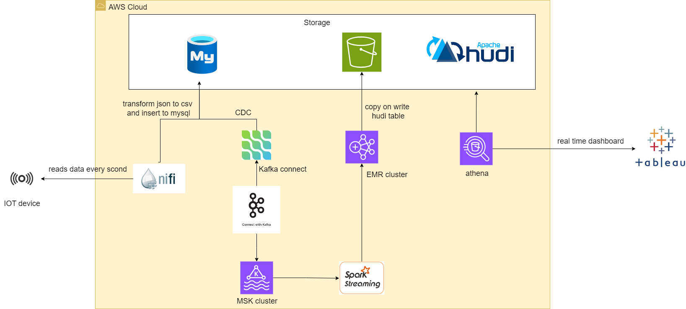
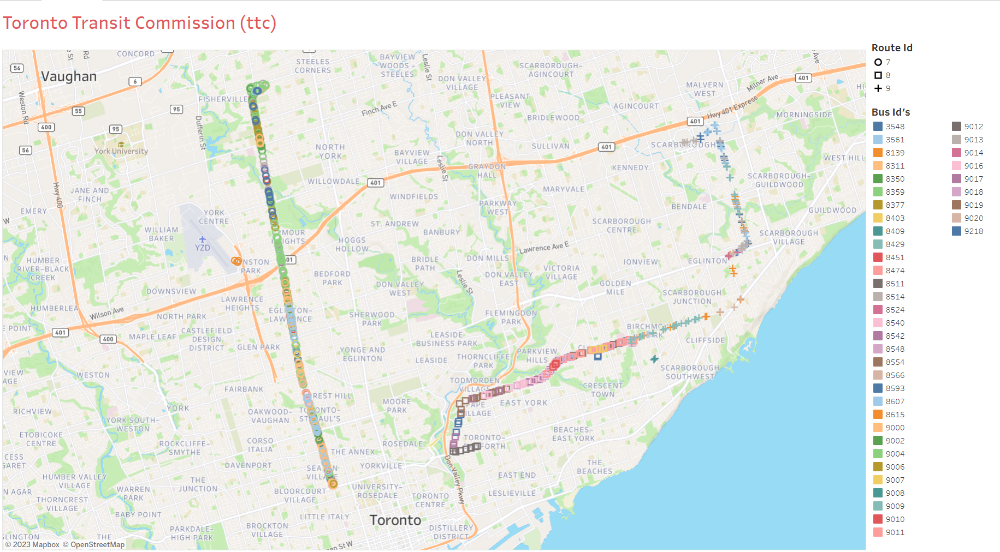
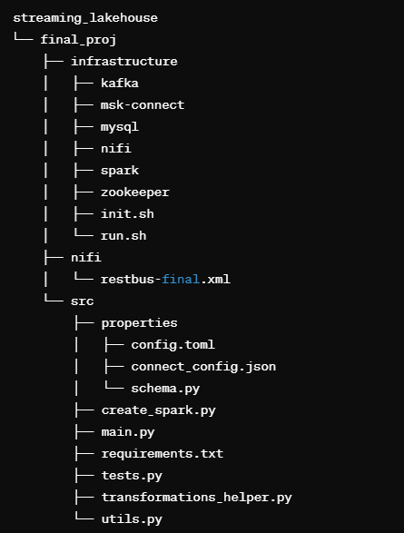
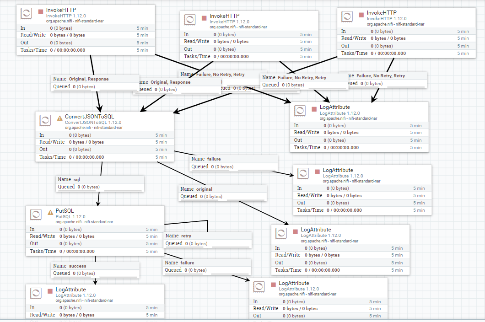

# Streaming Data Lakehouse

## Overview

This repository contains the source code and documentation for building a Streaming Data Lakehouse on real-time GPS data using Apache NiFi, Debezium, Apache Kafka (MSK), Apache Spark Structured Streaming, Docker, MySQL, and Tableau for visualization. The project focuses on collecting GPS data streamed by IoT devices located on buses, specifically utilizing data from the Toronto Transit Commission (TTC) provided through the Rest Bus API. The pipeline includes data extraction, transformation, loading, and visualization.

## Architecture Diagram


## Real Time Dashboard


## Project Workflow

### Data Ingestion:

- Apache NiFi extracts data from the Rest Bus API.
- Data is ingested into a MySQL database.
- Kafka Connect, Kafka, and Zookeeper monitor Write Ahead Logs on the MySQL database and write them to a MySQL table.

### Change Data Capture (CDC) Setup:

- Debezium captures change data from MySQL and sends it to a Kafka topic via Kafka Connect.

### Apache NiFi Setup:

- Apache NiFi extracts data from the bus API and sends it to the MySQL database.
- NiFi is deployed using Docker on an EC2 instance.

### Kafka, Debezium, and Zookeeper Setup:

- Kafka, Debezium, and Zookeeper are configured to capture and process change data from MySQL.

### Spark Processing:

- EMR with 1 master and 2 worker nodes is set up.
- The Spark submit command in `spark-submit.txt` is executed to submit the `restbus_app.zip` folder containing the Spark code.

### Athena Setup:

- Athena is configured with the required table schema for querying the processed data.

### Tableau Dashboard:

- Connect Tableau to visualize real-time data for route optimization.

## Folder Structure




## Getting Started

### Prerequisites

- Docker
- AWS EC2 (for NiFi deployment)
- AWS EMR (for Spark processing)
- MySQL
- Apache Kafka (MSK)
- Apache Zookeeper

### Configuration Files

- `config.toml`: Stores configuration settings for both development and production environments.
    - `[dev]`: Configuration settings for the development environment (local Kafka and Spark setup).
    - `[prod]`: Configuration settings for the production environment (MSK and EMR).
- `.env`: Stores secrets and sensitive information.


1. Clone the repository:
    ```bash
    git clone https://github.com/your_username/final_proj.git
    ```

2. Initialize project resources:
    ```bash
    cd final_proj/infrastructure
    ./init.sh
    ```

3. Start project resources:
    ```bash
    ./run.sh
    ```

4. Setup Apache NiFi, Debezium, Kafka, Spark, MySQL, EMR, and Tableau as described above.

## MySQL Database and Table Creation

```sql
CREATE DATABASE IF NOT EXISTS restbus;

USE restbus;

CREATE TABLE IF NOT EXISTS bus_status (
    record_id INT NOT NULL AUTO_INCREMENT,
    id INT NOT NULL,
    routeId INT NOT NULL,
    directionId VARCHAR(40),
    predictable BOOLEAN,
    secsSinceReport INT NOT NULL,
    kph INT NOT NULL,
    heading INT,
    lat REAL NOT NULL,
    lon REAL NOT NULL,
    leadingVehicleId INT,
    event_time DATETIME DEFAULT NOW(),
    PRIMARY KEY (record_id)
);

```

## NiFi Data Collection and Transformation

The NiFi process involves collecting data from the Rest Bus API endpoint in JSON format. The InvokeHTTP processor is configured to fetch data from the API every second. A ConverterJSONToSQL processor is added to convert JSON blobs into SQL inserts. The incoming JSON message includes fields like id, routeId, directionId, predictable, secsSinceReport, kph, heading, lat, lon, and leadingVehicleId. Data transformation involves converting JSON to SQL inserts and inserting records into the MySQL table.

## NiFi Flow


```json
[
   {
      "id":"8189",
      "routeId":"7",
      "directionId":"7_0_7",
      "predictable":true,
      "secsSinceReport":3,
      "kph":5,
      "heading":171,
      "lat":43.7837776,
      "lon":-79.4455647,
      "leadingVehicleId":null,
      "_links":{
         "self":{
            "href":"http://restbus.info/api/agencies/ttc/vehicles/8189",
            "type":"application/json",
            "rel":"self",
            "rt":"vehicle",
            "title":"Transit agency ttc vehicle 8189."
         },
         "to":[

         ],
         "from":[
            {
               "href":"http://restbus.info/api/agencies/ttc/vehicles",
               "type":"application/json",
               "rel":"section",
               "rt":"vehicle",
               "title":"A collection of vehicles for agency ttc."
            },
            {
               "href":"http://restbus.info/api/agencies/ttc/routes/7/vehicles",
               "type":"application/json",
               "rel":"section",
               "rt":"vehicle",
               "title":"A collection of vehicles currently on route 7 for agency ttc."
            }
         ]
      }
   }
]
```

## Debezium and Kafka Configuration

This JSON configuration sets up Debezium to capture changes from a MySQL database named "demo" and stream them to Kafka topics. The configuration specifies details such as database connection parameters, Kafka broker information, and topics for storing database history. Configure Debezium using the provided JSON configuration file `src/properties/connect_config.json`.

```json
{ 
    "name": "bus-connector", 
    "config": 
    { 
        "connector.class": "io.debezium.connector.mysql.MySqlConnector", 
        "tasks.max": "1", 
        "database.hostname": "mysql", 
        "database.port": "3306", 
        "database.user": "root", 
        "database.password": "debezium", 
        "database.server.id": "184054", 
        "database.server.name": "dbserver1", 
        "database.include.list": "demo", 
        "database.history.kafka.bootstrap.servers":"kafka:9092",
        "database.history.kafka.topic": "dbhistory.demo",
        "linger.ms": "5"
    } 
} 
```

## MSK Cluster Setup

- Test Telnet connection to ensure successful connection to the broker.
- Install Kafka client on the virtual machine.
- Obtain Zookeeper connection string and bootstrap servers from MSK cluster's client information.
- Set up environment variables with the obtained connection details.
- Verify MSK connection by retrieving topics using Kafka command.
- Start Debezium Connect container to establish MySQL to MSK connection.
- Monitor connection by checking for new topics and reading messages in the connection topic (my-connect-configs).
- Ensure the appearance of expected messages in the my-connect-configs topic.
- Read messages in the dbserver1.demo.bus_status topic to view incoming data.

## EMR Setup and Code Execution

### Prerequisites

- Ensure IAM Role associated with EC2 Instance Profile has AmazonS3FullAccess.
- Use the same EC2 key pair as your VM.
- Prepare the Python script for execution and package it into a zip file.

### Code Explanation

- The Python script (`main.py`) processes data from a Kafka topic (`dbserver1.demo.bus_status`) using Spark Structured Streaming.
- The `write_batch` method is responsible for writing a batch DataFrame to the Hudi table on the S3 data lake.
- It retrieves necessary configurations from the provided configuration file `config.toml`.
- Hudi and Kafka dependencies are included in the Spark submit command.
- Schema for data processing is loaded from an S3 bucket.
- Checkpointing is done on an S3 location for reliability.

### Configuration

```toml
[hoodie_options]
hoodie.table.name = "bus_status"
hoodie.datasource.write.table.type = "COPY_ON_WRITE"
hoodie.datasource.write.recordkey.field = "record_id"
hoodie.datasource.write.partitionpath.field = "routeId"
hoodie.datasource.write.operation = "upsert"
hoodie.datasource.write.precombine.field = "event_time"
hoodie.upsert.shuffle.parallelism = 100
hoodie.insert.shuffle.parallelism = 100
hoodie.cleaner.commits.retained = 2
```

### Spark Submit

```bash
# Submitting the spark streaming app using cluster mode with dependencies provided as jars
spark-submit \
	--packages org.apache.spark:spark-sql-kafka-0-10_2.12:3.3.2,org.apache.hudi:hudi-spark3-bundle_2.12:0.12.3 \
	--conf "spark.serializer=org.apache.spark.serializer.KryoSerializer" \
	--py-files sourceFile.zip main.py

```

## Athena Table Schema

Bulk add columns for your Athena table using the provided schema:
```sql
record_id int,
id int,
routeId int,
directionId string,
kph int,
predictable int,
secsSinceReport int,
heading int,
lat double,
lon double,
leadingVehicleId int,
event_time date

```

## Notes

- Regularly update Docker images and dependencies as needed.
- Ensure proper AWS IAM roles and policies are configured for AWS services.
- Monitor Apache NiFi, Kafka, and Spark using appropriate logging and monitoring tools.
- Maintain the project structure for easy management and scalability.
